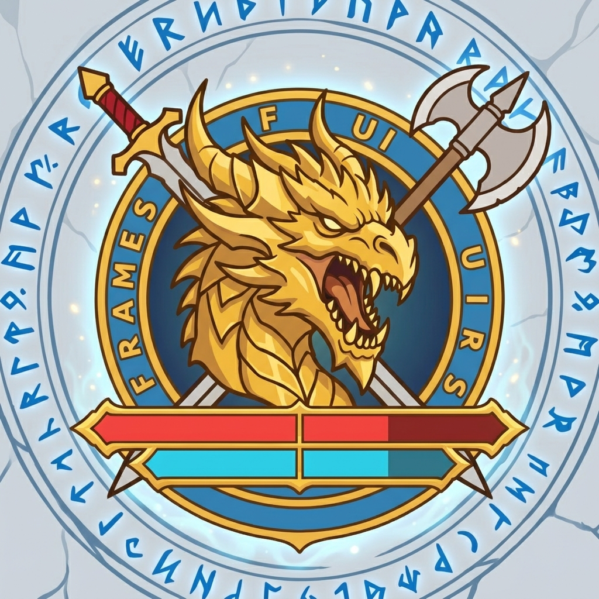

  

<h1 align="center">FrameBoss</h1>

A lightweight, standalone <strong>boss unit frame</strong> addon for World of Warcraft (Retail, 12.x). 
It replaces the default boss frames with up to five clean frames (<code>boss1</code>–<code>boss5</code>) that appear only during boss encounters and vanish when the boss units are gone.

## Features

- **Boss fights only** — driven by `INSTANCE_ENCOUNTER_ENGAGE_UNIT`; frames show on pull and hide automatically when the encounter ends
- **Compact layout** — a circular 56×56 portrait, a large 32px health bar with 2-decimal percentage text (`Offline` / `Dead` states included), and a 24px power bar that colors itself by power type and auto-hides for bosses without power
- **Native unit colors** — the health bar uses Blizzard's own `UnitSelectionColor` (hostile red, neutral yellow, tapped/dead gray), paired with the native nameplate look: a soft shadow behind the bars and the subtle "deselected" dimming overlay used on non-target nameplates
- **Smart auras**, rendered through Blizzard's native AuraContainer so they keep working with the "secret" encounter values introduced in 12.x — cooldown sweeps, stack counts, type-colored borders, and tooltips are all handled by the engine:
  - **Stealable** (Spellsteal) and **enrage** (offensive dispel) boss buffs — enlarged 28×28 icons
  - Ordinary boss buffs — 24×24 icons
  - Only **your own debuffs** (including your pet/vehicle) — 24×24 icons
- **Bilingual UI** — English (default) and Simplified Chinese, selected automatically from your client locale
- **Settings panel** (`/fb`) — overall scale (60%–200%), power bar toggle, edit mode (unlock and drag), reset position, and AceDB profiles. Closing the panel automatically exits edit mode
- **Test mode** — `/fb test` previews all five frames (including mock auras) anywhere in the world, making positioning easy
- **Standalone and lightweight** — built on native Blizzard APIs with Ace3 embedded; no ElvUI, WeakAuras, or all-in-one pack required

## Commands

| Command | Action |
|---|---|
| `/fb` or `/frameboss` | Open the settings panel |
| `/fb test` or `/fb edit` | Toggle edit mode (unlock drag + show test frames) |

## Installation

1. Download `FrameBoss-<version>.zip` from the [Releases page](https://github.com/gitdust/FrameBoss/releases)
2. Extract it into `World of Warcraft\_retail_\Interface\AddOns\`
   - The zip already contains a top-level `FrameBoss/` folder, including the embedded Ace3 libraries — no separate library download
3. In-game, run `/fb test` to preview and position the frames, then take them into a dungeon or raid to try them live

## Why FrameBoss?

I'm a standalone-addon player — I build my UI from individual addons and have never used an all-in-one compilation pack. I couldn't find an in-combat boss frame addon I actually enjoyed using, so I wrote FrameBoss myself, with the help of AI. It does exactly what I want and nothing more.
